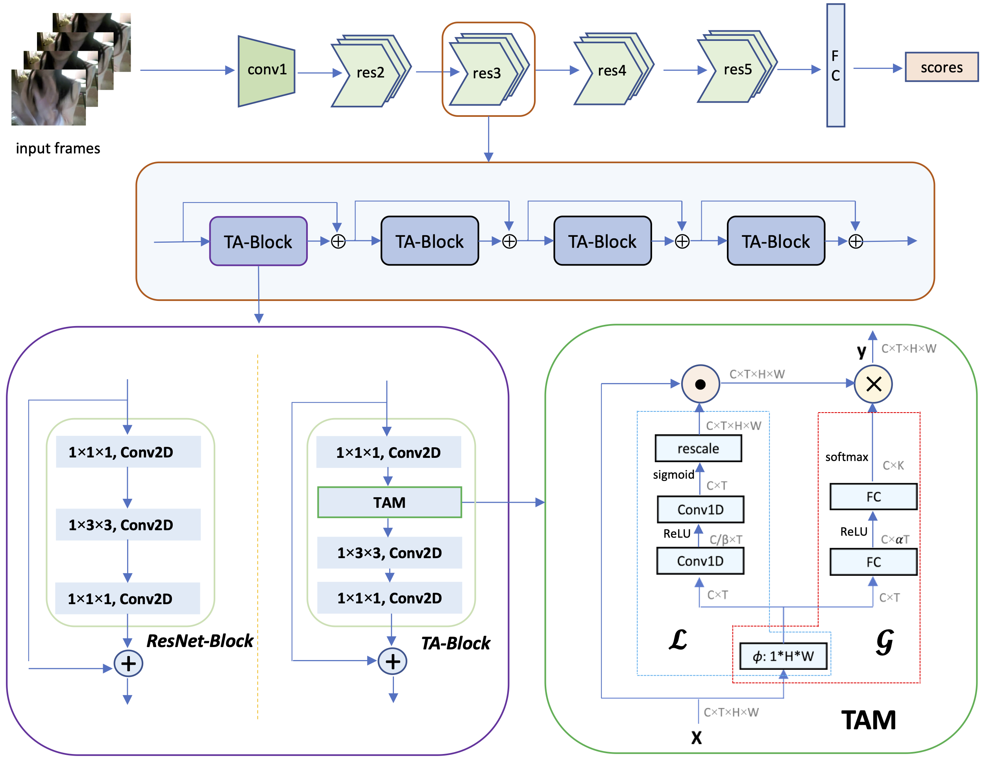

# TAM: Temporal Adaptive Module for Video Recognition  [[arXiv]](https://arxiv.org/abs/2005.06803)


```
@article{DBLP:journals/corr/abs-2005-06803,
  author    = {Zhaoyang Liu and
               Limin Wang and
               Wayne Wu and
               Chen Qian and
               Tong Lu},
  title     = {{TAM:} Temporal Adaptive Module for Video Recognition},
  year      = {2020},
  archivePrefix = {arXiv},
}
```


**[NEW!]**  We have released the code of TAM for research purpose.

## Overview


We release the PyTorch code of the [Temporal Adaptive Module](https://arxiv.org/abs/2005.06803).


<div  align="center">    
    
    <br>
    <div style="color:orange; border-bottom: 2px solid #d9d9d9;
    display: inline-block;
    color: #999;
    padding: 10px;">
      The overall architecture of TANet: ResNet-Block vs. TA-Block.
  	</div>
</div>


## Content


- [Prerequisites](#prerequisites)

- [Data Preparation](#data-preparation)

- [Pretrained Models](#pretrained-models)

- [Testing](#testing)

- [Training](#training)


## Prerequisites


The code is built with following libraries:


- python 3.6 or higher

- [PyTorch](https://pytorch.org/) 1.0 or higher

- [torchvision](https://github.com/pytorch/vision) 0.2 or higher

- [TensorboardX](https://github.com/lanpa/tensorboardX)

- [tqdm](https://github.com/tqdm/tqdm.git)

- [scikit-learn](https://scikit-learn.org/stable/)

- [opencv-python](https://pypi.org/project/opencv-python/) 4.1 or higher


## Data Preparation


As following [TSN](https://github.com/yjxiong/temporal-segment-networks) and [TSM](https://github.com/mit-han-lab/temporal-shift-module) repos, we provide a series of tools ([vidtools](https://github.com/liu-zhy/vidtools.git)) to extracte frames of video.

For convenience, the processing of video data can be summarized as follows:

- Extract frames from videos.

    1. Firstly, you need clone [vidtools](https://github.com/liu-zhy/vidtools.git):

        ```bash
        git clone https://github.com/liu-zhy/vidtools.git & cd vidtools
        ```

     2. Extract frames by running:

        ```
        python extract_frames.py VIDEOS_PATH/ \
        -o DATASETS_PATH/frames/ \
        -j 16 --out_ext png
        ```

        We suggest you use ```--out_ext jpg``` with limited disk storage.

- Generate the annotation.

    The annotation usually includes train.txt, val.txt and test.txt (optional). The format of *.txt file is like:

    ```
    frames/video_1 num_frames label_1
    frames/video_2 num_frames label_2
    frames/video_3 num_frames label_3
    ...
    frames/video_N num_frames label_N
    ```

    The pre-processed dataset is organized with the following structure:

    ```
    datasets
      |_ Kinetics400
        |_ frames
        |  |_ [video_0]
        |  |  |_ img_00001.png
        |  |  |_ img_00001.png
        |  |  |_ ...
        |  |_ [video_1]
        |     |_ img_00001.png
        |     |_ img_00002.png
        |     |_ ...
        |_ annotations
           |_ train.txt
           |_ val.txt
           |_ test.txt (optional)
    ```

- Configure the dataset in [ops/dataset_configs.py](ops/dataset_configs.py).


## Model ZOO


Here we provide some off-the-shelf [pretrained models](https://drive.google.com/drive/folders/1H53eLM30cknAlFmMklLA9YoB1i34xh_1?usp=sharing). The accuracy might vary a little bit compared to the [paper](https://arxiv.org/abs/2005.06803), since the raw video of Kinetics downloaded by users may have some differences. 

| Models  | Datasets     | Resolution | Frames * Crops * Clips | Top-1 | Top-5 |                         Checkpoints                          |
| :-----: | ------------ | :--------: | :--------------------: | ----- | ----- | :----------------------------------------------------------: |
| TAM-R50 | Kinetics-400 | 256 * 256  |       8 * 3 * 10       | 76.1% | 92.3% | [ckpt](https://drive.google.com/drive/folders/1sFfmP3yrfc7IzRshEELOby7-aEoymIFL?usp=sharing) |
| TAM-R50 | Kinetics-400 | 256 * 256  |       16 * 3 * 10       | 76.9% | 92.9% | [ckpt](https://drive.google.com/drive/folders/1nCefjTSPm0Q67e2oSHAhYQgofcim9jOe?usp=sharing) |
| TAM-R50 | Sth-Sth v1   | 224 * 224  |       8 * 1 * 1        | 46.5% | 75.8% | [ckpt](https://drive.google.com/drive/folders/1XX5CNDvckaV7d9EH24SXmQsMT7s_a3Zm?usp=sharing) |
| TAM-R50 | Sth-Sth v1   | 224 * 224  |       16 * 1 * 1       | 47.6% | 77.7% | [ckpt](https://drive.google.com/drive/folders/1wPbID2bVETG91SxpDURI_GeAOn8sqCda?usp=sharing) |
| TAM-R50 | Sth-Sth v2   | 256 * 256  |       8 * 3 * 2        | 62.7% | 88.0% | [ckpt](https://drive.google.com/drive/folders/1dNxo2F4yiREfq4FdFAaSzPZbtYz8qrq7?usp=sharing) |
| TAM-R50 | Sth-Sth v2   | 256 * 256  |       16 * 3 * 2       | 64.6% | 89.5% | [ckpt](https://drive.google.com/drive/folders/1dr5MEJKVEL_xVFrrHDzPOmdV_xZHX2Py?usp=sharing) |

After downloading the checkpoints and putting them into the target path, you can test the TAM with these pretrained weights.


## Testing


For example, to test the downloaded pretrained models on Kinetics, you can run `scripts/test_tam_kinetics_rgb_8f.sh`. The scripts will test TAM with 8-frame setting:


```bash
# test TAM on Kinetics-400
python -u test_models.py kinetics \
--weights=./checkpoints/kinetics_RGB_resnet50_tam_avg_segment8_e100_dense/ckpt.best.pth.tar \
--test_segments=8 --test_crops=3 \
--full_res --sample dense-10 --batch_size 8

```

We should notice that `` --sample`` can determine the sampling strategy in the testing. Specifically, ```--sample uniform-N``` denotes the model takes N clips uniformly sampled from video as inputs, and ```--sample dense-N``` denotes the model takes N clips densely sampled from video as inputs.


You also can test TAM on Something-Something V2 by running scripts/test_tam_somethingv2_rgb_8f.sh:

```bash
# test TAM on Something-Something V2
python -u test_models.py somethingv2 \
--weights=./checkpoints/something_RGB_resnet50_tam_avg_segment8_e50/ckpt.best.pth.tar \
--test_segments=8 --test_crops=3 \
--full_res --sample uniform-2 --batch_size 32
```


## Training


We provided several scripts to train TAM in this repo:

- To train on Kinetics from ImageNet pretrained models, you can run `scripts/train_tam_kinetics_rgb_8f.sh`, which contains:

    ```bash
      python -u main.py kinetics RGB --arch resnet50 \
      --num_segments 8 --gd 20 --lr 0.01 --lr_steps 50 75 90 --epochs 100 --batch-size 8 \
      -j 8 --dropout 0.5 --consensus_type=avg --root_log ./checkpoint/this_ckpt \
      --root_model ./checkpoint/this_ckpt --eval-freq=1 --npb \
      --self_conv  --dense_sample --wd 0.0001
    ```

    After training, you should get a new checkpoint as downloaded above. 


- To train on Something-Something dataset (V1 & V2), you can run following commands:


    ```bash
    # train TAM on Something-Something V1
    bash scripts/train_tam_something_rgb_8f.sh
    
    # train TAM on Something-Something V2
    bash scripts/train_tam_somethingv2_rgb_8f.sh
    ```

